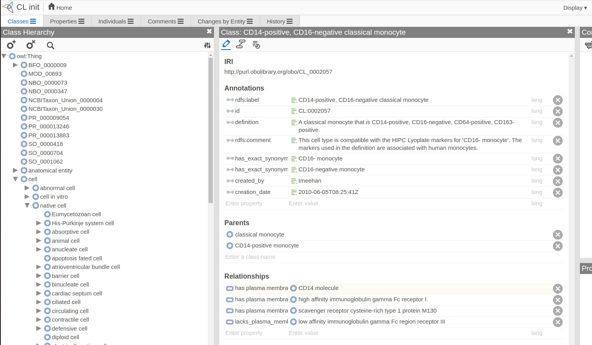

# Introduction: ontologies for information science

- Systematic controlled and versioned vocabularies with fixed-length tags
- Relationships among terms and term referents are formally defined
- Languages or markups for defining and computing with ontologies:
    - RDF/OWL
    - OBO (stanzas)
- Tools for manipulating and using ontologies
    - R ecosystem: ontologyIndex, rols, glitter (RDF querying)
    - Protege
    - ROBOT, pronto

# Two applications

- Precise characterization of phenotypes in GWAS
- Cell type identification with scRNAseq

## GWAS

We'll look at two GWAS resources that use ontologies in the characterization
of traits.

### gwascat

EBI produces a catalog of GWAS results, retaining those
that are significant and validated.

```{r doont}
suppressPackageStartupMessages({
library(onto2022)
})
if (!exists("newcat")) data(newcat)
newcat
mcols(newcat[1,])$MAPPED_TRAIT_URI
```

EFO is experimental factor ontology.
We have a copy (likely somewhat out-of-date)
in the ontoProc package.

```{r lkefo}
efo = getEFOOnto()
efo$name["EFO:0007789"]
```

### ieugwasr

The Bristol Integrative Epidemiology Unit curates
a large collection of summary statistics for many GWAS.

```{r lkieu, cache=TRUE}
library(ieugwasr)
gi = gwasinfo()
gi
tail(sort(table(gi$ontology)))
```

## Cell ontology

The SingleR book of Aaron Lun provides basic motivation and examples.


We can explore Cell Ontology interactively using Web Protege:



Of note are the additional annotations, relating the cell type to
plasma membrane proteins.

Visualizing the derivation of some types of interest:
```{r lkco,cache=TRUE}
cl = getCellOnto()
head(cl$name)
cl3k = c("CL:0000492", "CL:0001054", "CL:0000236", "CL:0000625",
"CL:0000576", "CL:0000623", "CL:0000451", "CL:0000556")
onto_plot2(cl, cl3k)
```

Use `ctmarks(cl)` for interactive visualization of a subset of cell types of interest:
those for which plasma membrane protein relationships have been encoded.
